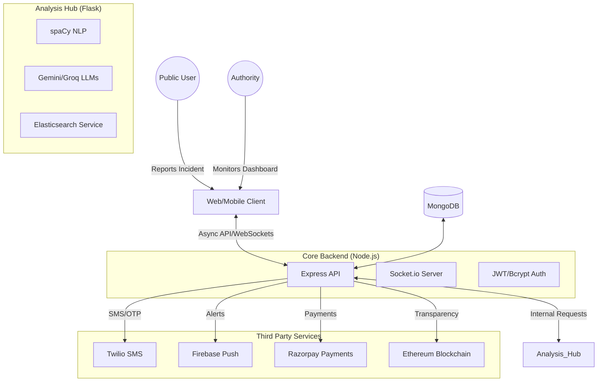

# RescuNet: High-Level Design (HLD) & System Architecture

## Real-Time Disaster Alert & Communication System

### 1. Introduction

RescuNet is a comprehensive, state-of-the-art disaster management and real-time alert platform designed to bridge the gap between authorities and the public during emergency scenarios. The system leverages multi-layered data ingestion, advanced AI (LLMs & NLP), blockchain transparency, and real-time communication protocols to ensure rapid response and accurate information dissemination.

---

### 2. Comprehensive System Architecture

The system is built on a distributed micro-modular architecture, ensuring scalability and fault tolerance. It consists of four primary layers:

#### 2.1. Data Ingestion Layer (The Radar)

The system captures data from three distinct streams:

- **Social Media Stream**: Real-time monitoring of social feeds using APIs and automated monitoring bots.
- **Official & News Stream**: Ingestion of RSS feeds and news scrapers to verify ongoing events.
- **Citizen Report Stream**: Deep-link reports from the RescuNet mobile app and web portal where users can upload photos, location, and descriptions of incidents.

#### 2.2. Processing & Analysis Layer (The Brain)

This layer resides primarily in the **Flask Analysis Server**:

- **NLP Engine (spaCy)**: Performs Named Entity Recognition (NER), detecting disaster types, locations, and timeframes from raw text.
- **Semantic Search (Elasticsearch)**: Indexes unverified and verified posts, allowing for high-performance, fuzzy-search-enabled historical and real-time data retrieval.
- **LLM Synthesis (Gemini & Groq)**: Uses large language models to:
  - Generate "One-Liner" summaries for mobile notifications.
  - Compile daily disaster reports for response authorities.
  - Power the RescuBot, a multilingual conversational agent for public assistance.
- **Trend Analysis**: Integration with traffic and search trends to identify sudden spikes in keyword volume.

#### 2.3. Communication & Alert Layer (The Voice)

- **Real-Time Push (Socket.io)**: Establishes a permanent bi-directional link between the server and all active dashboards/apps for instant SOS alerts.
- **Multi-Channel Delivery**:
  - **Firebase Cloud Messaging (FCM)**: Mobile push notifications for high-priority alerts.
  - **Twilio SMS**: Critical OTPs and low-bandwidth SMS alerts.
  - **Nodemailer**: Formal reporting and email-based registration.

#### 2.4. Accountability & Storage Layer (The Foundation)

- **Primary Database (MongoDB)**: Scalable document storage for users, incident reports, and fundraisers.
- **Blockchain (Web3/Ethereum)**: Every donation made through the platform is recorded on a blockchain ledger, ensuring 100% transparency.

---

### 3. Technical Deep-Dive

#### 3.1. NLP & Disaster Detection Logic

The system uses the `en_core_web_lg` spaCy model with custom PhraseMatchers to identify disaster-related keywords.

- **Entities Extracted**: Disaster Type (e.g., Flood), Location, Date/Time, and Intensity.
- **Heuristic Priority**: Reports mentioning critical keywords are automatically assigned `High` priority.

#### 3.2. Database Schema (MongoDB Core)

- **Users**: `{ email, name, role (Admin/Public), location }`
- **Issues**: `{ title, desc, coordinates, disasterType, status (Pending/Verified), priority }`
- **Donations**: `{ amount, transactionHash, donorId, fundraiserId, timestamp }`

#### 3.3. Blockchain Integration (Web3)

Transparency is achieved by emitting a transaction on the Ethereum blockchain for every successful payment verification. This ensures that the total funds raised can be audited by the public independently of the app's internal database.

#### 3.4. API Contracts (Key Endpoints)

- `POST /api/v1/user/register`: Handles user onboarding with OTP verification.
- `POST /api/v1/sos`: Triggers immediate Socket.io broadcast to all nearby admin units.
- `POST /flask/search/elastic`: Proxies semantic search queries to the Elasticsearch cluster.
- `POST /flask/gemini/report`: Triggers LLM generation of a comprehensive disaster analysis report.

---

### 4. High-Level Design (HLD) Diagram

---

### 5. System Reliability & Demo Mode

To ensure the system remains functional for demonstration purposes in environments without active API keys or external services, a robust **Demo Mode** has been implemented.

- **Service Mocks**: Twilio, Razorpay, and Firebase are automatically mocked when `DEMO_MODE=true`.
- **API Fallbacks**: LLMs return structured placeholder responses, and Elasticsearch gracefully falls back to empty result sets if the cluster is unreachable.
- **Deterministic Logic**: OTPs are logged to the console, and mobile verification is pre-validated to allow end-to-end flow testing.

---

### 6. Scalability and Future Roadmap

- **Geo-fencing Alerts**: Implementing precise location-based alerting.
- **Edge Deployment**: Deploying the analysis hub closer to disaster-prone areas.
- **Offline Sync**: PWA capabilities for the mobile client.
- **Satellite Data**: Future integration with satellite feeds for real-time flood mapping.
